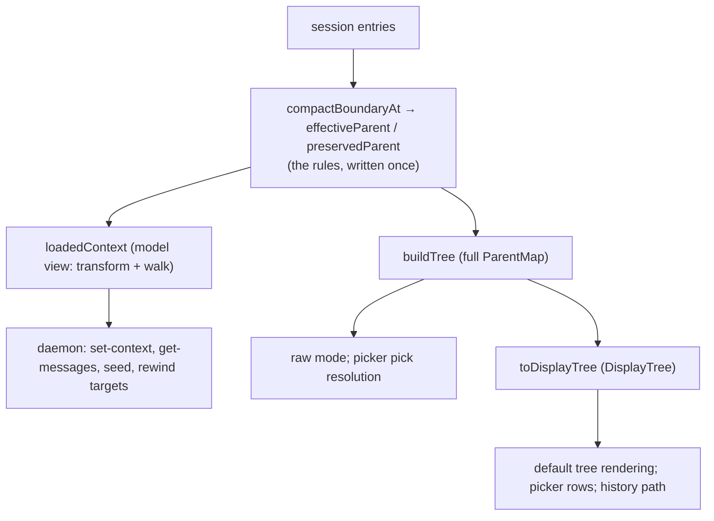

# Spec: session tree — loader model, full tree, display tree

> Status: **draft, awaiting review.** Supersedes
> `docs/specs/boundary-display-linearization.md` (whose user-facing goals
> carry over, but whose mechanism was built on a guessed loader model) and
> rewrites the relink machinery from `docs/specs/boundary-substructure.md`.
> Ground truth: the CLI loader's relink logic, read directly out of the
> bundled binary (see "Ground truth" below).

# SPEC

## Problem

Our model of the CLI loader (`effective-chain.ts`) was reverse-engineered
from probe behavior and guessed wrong in places: it special-cases the
summary entry via `isCompactSummary`, invents a relinked summary occurrence
(`S@B`), composes all boundaries through a running occurrence map, and has
no notion of the loader's cut. `buildTree` inherited that confusion
(summary lookahead, pending-relink deferral), and the display layer then
needed compensating machinery (block-tail exceptions, exhaustive
representative maps, path deduplication).

We have since decompiled the loader's actual relink transform. This spec
rebuilds the whole domain on it, as three layers in `src/core/tree/`:

- **`loadedContext`** — what the model sees: our best estimate of the
  transcript entries a resume would load, in exact order (a port of the
  loader transform, with named divergences — see Edge cases).
- **`buildTree`** — every occurrence: the full tree of all raw entries plus
  each valid boundary's relinked block. What `raw` filter mode shows; the
  superset every navigation target lives in.
- **`toDisplayTree`** — what the human sees: the full tree minus relinked
  duplicates and boundary forks, so a linear conversation with any number
  of compactions renders as one straight line.

## Ground truth: the loader's relink transform

Extracted from the Claude Code CLI binary v2.1.170 (Bun-compiled; the JS
bundle is embedded as plain text — `grep -a -o -b preservedMessages
<binary>` for offsets, then dump and read the surrounding minified source).
Re-extract the same way on CLI upgrades. The transform, applied to the
uuid→entry map (file order) at load time:

1. Let `K` = index of the **last** `compact_boundary` entry of any kind,
   and `meta` = the `compactMetadata` of the last boundary that has
   `preservedMessages` (or legacy `preservedSegment`). If no boundary has
   metadata, stop — no transform at all.
2. The relink rules run only when the metadata boundary IS the last
   boundary (last-wins is total). Resolve `preserved = {anchorUuid?,
   uuids}` (from the list, or a tail→head walk for `preservedSegment`).
3. If any preserved uuid names no transcript entry: telemetry, **abort the
   whole transform** (no rewrite, no cut).
4. If `uuids` is non-empty:
   - **Chain rewrite**: `uuids[0].parentUuid = anchorUuid`,
     `uuids[i].parentUuid = uuids[i-1]`.
   - **Anchor-child reparent**: EVERY entry with `parentUuid == anchorUuid`
     (except `uuids[0]`) gets `parentUuid = uuids.last()`. There is no
     summary concept: from-shape summary placement (anchor = boundary uuid,
     summary parented on the boundary) is just an instance of this rule.
     `isCompactSummary` appears nowhere in the transform.
   - Usage fields on preserved assistant entries are zeroed.
5. **The cut**: delete every entry with file index `< K` not in `uuids`
   (runs even when `uuids` is empty or the last boundary has no metadata —
   this is why an empty-`uuids` trailing boundary yields an empty context,
   P10). Then **orphan reparent**: surviving user/assistant entries whose
   parent was deleted get `parentUuid = uuids.last()` (only when `uuids`
   is non-empty).

6. **Leaf selection** (decoded from the transform's caller): collect
   entries that are nobody's parent in the TRANSFORMED relation; a single
   dangling tip is the leaf; with multiple tips — or when no relink ran —
   walk up from the last file entry (or an explicit leaf-marker entry) to
   the nearest user/assistant entry. No summary special-case: a file
   ending at an up_to summary has exactly one tip, the preserved tail,
   because the chain rewrite hangs `uuids[0]` under the summary.

The context a resume loads is then the ordinary `parentUuid` walk from
that leaf over the transformed map, boundaries acting as chain ends.

Caveats: binary v2.1.170 vs probes on v2.1.195/2.1.211 — every probe
observation in `docs/derisk/compact-boundary-injection/FINDINGS.md` is
consistent with this code except P3 m4's duplicate-uuid skip, which has no
visible check here (version drift, or downstream cycle detection). We keep
the duplicate-uuid validation, justified by the probe.

## Success criteria

1. `loadedContext` reproduces the transform's observable outcomes, each
   as a test case: no metadata anywhere (no transform), trailing
   metadata-less boundary after a metadata boundary (cut, nothing
   preserved), valid empty list (pure wipe), missing preserved uuid
   (abort — no rewrite AND no cut), anchor-child reparent, chain rewrite,
   orphan reparent, single-tip and multi-tip leaf selection. Scope:
   `preservedMessages` boundaries; deliberate divergences (duplicate
   uuids, legacy segments, usage zeroing) are named in Edge cases.
2. A native up_to compaction of a linear conversation renders linearly
   (default filter modes) — see the concrete example below. Several
   stacked compactions render as one straight line.
3. A boundary rewind (from-shape, no summary) with no new turn is
   invisible: the tree reads identically to a plain tail rewind, cursor on
   the rewind target.
4. `raw` filter mode renders `buildTree` verbatim, `~` marking every
   `@boundary` row. Default modes never render an `@boundary` row, so `~`
   appears only in `raw` mode.
5. `/tree` picker rows are display rows. User-row picks resolve their
   nearest assistant ancestor on the FULL tree (editing a post-compaction
   message stays inside the compacted context). Boundary-row and
   summary-row picks are the same action, "undo the boundary": rewind to
   the last assistant ref of `loadedContext(entries before the boundary)`,
   `newRoot` if none, no editor prefill.
6. TUI conversation history renders the display path: each message once,
   boundary banners and summaries in display order — no dedupe pass.
7. The `[cursor: …]` line keeps printing the true leaf uuid; the `*`
   marker sits on the leaf's visible display row (they legitimately differ
   after a fresh compaction: marker on the summary row, cursor on the
   preserved tip). A leaf whose `visibleRowOf` entry is null renders no
   marker.
8. Diagnostics: invalid relinks (missing/duplicated preserved uuid),
   dangling anchors, and parent cycles report through `OnInvalid` and
   degrade per the Edge cases; a duplicate occurrence key throws.

## Concrete examples

Up_to compaction (raw `1→2→3→4`, boundary `B` preserving `[3,4]`, anchor =
summary `S`, next turn `5` with `parentUuid: 4`):

```
raw mode                          default modes
• 1 user: …                       • 1 user: …
• 2 assistant: …                  • 2 assistant: …
├─ 3 user: …                      • 3 user: …
│     4 assistant: …              • 4 assistant: …
└─ • B [compaction]               • B [compaction]
   • S compaction: …              • S compaction: …
   • ~3 user: …                   * 5 user: …
   • ~4 assistant: …
   * 5 user: …
```

Full tree: `S` under `B` (raw parent), `3@B` under `S` (chain rewrite),
`4@B` under `3@B`, `5` under `4@B` (last-boundary lens). Display: hide
`3@B`/`4@B`, reparent `B` onto raw `4`; `5`'s nearest visible ancestor is
`S`. Display order shows `S` after `3,4` although the loaded context is
`[S,3,4,5]` — accepted display fiction; `raw` mode shows the full
occurrence structure (neither the disk bytes nor the loaded context: the
diagnostic superset both derive from).

From-shape rewind to `2` (boundary `X` preserving `[1,2]`, anchor = `X`
itself, summary `T`, then one new turn `5` with `parentUuid: T`):

```
default modes
• 1 user: …
• 2 assistant: …
├─ • X [compaction]
│  • T compaction: …
│     * 5 user: …
└─ 3 user: …
      4 assistant: …
```

Full tree: `1@X` under `X`, `2@X` under `1@X`, `T` under `2@X`
(anchor-child rule — `T`'s single occurrence is raw), `5` under `T`.
Display: hide `1@X`/`2@X`; `X` reparents onto raw `2`; `T`'s nearest
visible ancestor is `X`.

Same rewind with NO summary and NO new turn: `X` has no visible
descendants and prunes away; the tree reads `1 → *2 → 3 → 4` —
indistinguishable from a plain tail rewind. The leaf ref `2@X` maps to
visible row `2` for the marker.

Stacked compactions (raw `1→2→3→4`, `B1` preserving `[3,4]` anchor `S1`;
turns `5,6`; `B2` preserving `[5,6]` anchor `S2`; turn `7`):

```
full tree:    1→2→3→4          display:   • 1 … • 2 … • 3 … • 4 …
              B1 under 2*, S1 under B1        • B1 [compaction]
              3@B1 under S1, 4@B1 under 3@B1  • S1 compaction: …
              5 under 4@B1, 6 under 5         • 5 … • 6 …
              B2 under 6*, S2 under B2        • B2 [compaction]
              5@B2 under S2, 6@B2 under 5@B2  • S2 compaction: …
              7 under 6@B2                    * 7 …
```

(`*` = logicalParentUuid anchor before display reparenting.) Display:
`B1` reparents onto raw `4`, `B2` onto raw `6`; hidden `4@B1` resolves
`5` to `S1`, hidden `6@B2` resolves `7` to `S2` — one straight line,
criterion 2's stacked case. `visibleRowOf` = `{3@B1→S1, 4@B1→S1,
5@B2→S2, 6@B2→S2}`; loaded context `[S2,5,6,7]`.

## Type design

New directory `src/core/tree/`. `src/core/tree.ts`, `build-tree.ts`,
`build-display-tree.ts`, and `effective-chain.ts` are deleted; their
survivors move as noted.

**`src/core/tree/nodes.ts`** — the node vocabulary, moved verbatim from
`src/core/tree.ts`: `TreeNodeRef`, `formatTreeNodeRef`, `parseTreeNodeRef`,
`treeNodeRefsEqual`, `ParentMap` re-export, `SessionSnapshot`, `PathNode`,
`pathToLeaf`, `treeChildren`, `isFinalAssistantEntry` (doc comments updated
to the new names).

**`src/core/tree/loader.ts`** — the loader model. Owns every relink rule.

```ts
/** Sink for corrupt-session-file diagnostics. */                 // moved from effective-chain.ts
export type OnInvalid = (message: string) => void;

/** A compact_boundary entry's relink instruction, mirroring the jsonl
 *  field names. Parse-only — validity is a separate question (mirroring
 *  the binary, where parsing and step-3 validation are distinct).
 *  preservedMessages absent = the boundary carries no modeled metadata.
 *  Legacy segment-only boundaries parse as metadata-less — a known,
 *  deliberate divergence (the loader resolves them by a tail→head walk;
 *  see Edge cases). */
export interface CompactBoundary {
  uuid: UUID;
  preservedMessages?: { anchorUuid?: UUID; uuids: UUID[] };
}

/** Parse the boundary at entries[boundaryIndex]. Precondition: that entry
 *  is a compact_boundary — throws otherwise (caller bug, not file
 *  corruption). Empty uuids parses as present (a pure wipe: rules no-op,
 *  the cut still applies). */
export function compactBoundaryAt(
  entries: SessionEntry[],
  boundaryIndex: number,
): CompactBoundary;

/** Step-3 validation, written once: the reason this boundary's relink
 *  must not apply — a preserved uuid naming no file entry
 *  (loader-observed; anywhere in the file, NOT just earlier — the loader
 *  validates against the complete map) or a duplicated uuid
 *  (probe-observed, P3 m4) — or undefined when the relink applies.
 *  loadedContext aborts its transform on it; buildTree emits no block;
 *  both report it through their onInvalid. */
export function invalidRelinkReason(
  fileUuids: ReadonlySet<UUID>,
  boundary: CompactBoundary,
): string | undefined;

/** Loader parent rewrite under this boundary's relink: parentUuid ==
 *  anchorUuid (anchor present, uuids non-empty) → uuids.last(); otherwise
 *  the raw parentUuid. THE anchor-child rule — the only place it is
 *  written. loadedContext applies it map-wide (as the loader does);
 *  buildTree applies it forward from the boundary — divergent only for
 *  hand-crafted pre-boundary references to the anchor. */
export function effectiveParent(
  boundary: CompactBoundary,
  entry: SessionEntry,
): UUID | undefined;

/** Parent of uuids[index] inside the relinked chain: anchorUuid for
 *  index 0, uuids[index-1] after. THE chain-rewrite rule. */
export function preservedParent(
  boundary: CompactBoundary,
  index: number,
): UUID | undefined;

/** Our best estimate of the loaded context: the transcript entries the
 *  loader selects, in exact order — the ground-truth transform
 *  (last-boundary rules via effectiveParent/preservedParent, the cut,
 *  orphan reparent), then the parent walk from the leaf per ground-truth
 *  step 6 (single dangling tip, else nearest user/assistant at-or-above
 *  the last file entry). Estimate: downstream request normalization
 *  (tool-pair sanitization, attachment dropping, API-message grouping —
 *  FINDINGS "failure modes") is out of scope. Replaces
 *  effectiveTreeNodeChain. An element carries viaBoundary iff its uuid is
 *  among the last boundary's preserved uuids. */
export function loadedContext(
  entries: SessionEntry[],
  onInvalid: OnInvalid,
): TreeNodeRef[];

/** Uuid projection of loadedContext. Replaces effectiveChain. */
export function loadedContextUuids(
  entries: SessionEntry[],
  onInvalid: OnInvalid,
): UUID[];
```

Deleted with no replacement: `BoundaryRelink`, `validRelink`.
`seedFromEntries` moves to `src/core/session-seed.ts` unchanged except for
calling `loadedContext`. `summaryOf` SURVIVES but leaves the loader model:
it is clauctl bookkeeping about summaries clauctl (or the CLI) wrote —
`get-messages.ts` (synthesis-window closure) and `set-context.ts`
(boundary-block end) still need it — and moves to
`src/core/session-file.ts` next to the other entry-scan utilities.

**`src/core/tree/build-tree.ts`**

```ts
/** Every occurrence: raw entries under their lens parents
 *  (effectiveParent, decorated to `uuid@B` keys when the parent uuid is
 *  among the lens boundary's preserved uuids), plus each boundary's
 *  relinked block `uuids[i]@B → preservedParent(i)` — emitted only when
 *  the boundary carries preservedMessages AND invalidRelinkReason
 *  returns undefined — at the boundary's file position
 *  (block parent keys may be forward references: the up_to anchor, or a
 *  preserved uuid naming a later entry; a final pass nulls parents that
 *  never materialized). Lens lifecycle: EVERY encountered boundary
 *  replaces the lens — invalid, empty, or metadata-less boundaries
 *  install a lens with no rules, ending the previous boundary's
 *  (last-wins). Boundary entries anchor at logicalParentUuid, resolved
 *  through the prior lens's decoration like any other parent reference.
 *  Exactly one raw occurrence per uuid-bearing entry — no occurrence map,
 *  no pending state, no summary special case. Throws on a duplicate
 *  occurrence key. */
export function buildTree(
  entries: SessionEntry[],
  onInvalid: OnInvalid,
): ParentMap;
```

`buildTree` calls `compactBoundaryAt`, `invalidRelinkReason`,
`effectiveParent`, and `preservedParent`; it restates no rule.

**`src/core/tree/display-tree.ts`**

```ts
export interface DisplayTree {
  /** Visible rows only. */
  parentMap: ParentMap;
  /** Hidden occurrence id → its nearest visible ancestor row, or null
   *  when the hidden chain is rootless (anchor-less or dangling-anchor
   *  blocks — hand-crafted/corrupt shapes; a null-mapped leaf renders no
   *  marker, matching filtered-leaf behavior). Defined for every hidden
   *  id (relinked rows, pruned boundary rows). Sole purpose: mapping a
   *  hidden leaf ref to the row that carries the `*` marker / picker
   *  cursor. Picker rows themselves are all visible. */
  visibleRowOf: Map<string, string | null>;
}

/** The human view, derived from the full tree by three rules:
 *  1. each boundary row with a valid non-empty preserved list reparents
 *     onto the raw row of its last preserved uuid;
 *  2. every `@boundary` row is hidden; anything whose parent is hidden
 *     displays under its nearest visible ancestor;
 *  3. a boundary row with a valid NON-EMPTY preserved list and no
 *     visible descendants is hidden too (fixpoint, so stacked navigation
 *     boundaries cascade away).
 *  Boundaries with no applicable relink — metadata-less, invalid, or
 *  empty-list (a context wipe is a real event) — keep their placement
 *  and stay visible. Display-only: loadedContext and the wire protocol
 *  are untouched. */
export function toDisplayTree(
  fullTree: ParentMap,
  entries: SessionEntry[],
): DisplayTree;
```

Taking `fullTree` as input keeps the derivation explicit at call sites and
makes the transform testable against hand-built maps. Precondition:
`fullTree` came from `buildTree` over the same `entries` — mismatched
inputs are unchecked. No `OnInvalid`: it re-derives boundary validity via
`compactBoundaryAt`/`invalidRelinkReason` without reporting (diagnostics
belong to the `buildTree` call).

**Consumers** (signatures, not implementations):

- `src/format/tree.ts`: `raw` stays in `FILTER_MODES`; `raw` renders
  `buildTree` output with `~` before the uuid column on `@boundary` rows;
  all other modes render `toDisplayTree(buildTree(...), ...)` with the
  leaf marker mapped through `visibleRowOf` when the leaf row is hidden.
- `src/tui/components/tree-selector.ts`: `TreeSelectorComponent` takes the
  `DisplayTree`; `resolveTreePick(fullTree, entries, entryOf, pick,
  onInvalid)` implements criterion 5 (boundary/summary undo via
  `loadedContext(entries.slice(0, boundaryIndex))`; summary rows
  identified for the pick action by `isCompactSummary` + boundary parent —
  a UX affordance, not loader modeling).
- `src/tui/interactive-mode.ts` / `sdk-render.ts`: `reloadHistory` renders
  `pathToLeaf(displayTree.parentMap, entryOf, visibleLeafRow)`;
  `dedupedPathNodes` is deleted (a display path has no duplicates by
  construction); `pathUpToBoundary` adapts to display rows (replay cut at
  the live leaf's visible row; keep post-leaf boundary/summary rows, whose
  live events render no text).
- Full migration surface (mechanical renames/imports beyond the above):
  `src/core/daemon/request-handlers.ts`, `daemon.ts`, `set-context.ts`,
  `get-messages.ts` (`effectiveChain`/`effectiveTreeNodeChain` →
  `loadedContext*`, `summaryOf` import path), `src/format/input.ts` and
  daemon startup (`seedFromEntries` relocation), plus tests and doc
  comments referencing the old occurrence semantics.

## Data flow



## Cost

- Compute/memory: each layer parses boundaries once per invocation and
  runs in O(n) with small maps (the display transform needs a child-count
  pass before pruning — forward block references mean rows are NOT
  strictly children-after-parents in materialization order). Negligible
  at session-file scale.
- The real cost is **regression surface**: this rewrites the shipped
  `effective-chain.ts`/`build-tree.ts` semantics and discards most of the
  uncommitted boundary-display-linearization implementation. Mitigations:
  test fixtures re-derived from the ground-truth transform; the derisk
  harness + `check-reports.mjs` remain the CLI-upgrade gate. Review effort
  should concentrate on `loader.ts`'s fidelity to the dump.

## Edge cases

- **Empty `uuids`**: valid; rules no-op (children of the anchor stay put),
  the cut still deletes everything before the boundary (P10).
- **Invalid relink** (`invalidRelinkReason` set — a preserved uuid naming
  no file entry, or a duplicated uuid): the boundary emits no block,
  stays at its logicalParentUuid anchor, remains visible, and — distinct
  from a metadata-less boundary — ABORTS `loadedContext`'s transform
  (no cut; pre-boundary entries stay loadable-in-principle, though the
  walk still ends at the boundary). Validation is against uuids anywhere
  in the file (loader-faithful), not "earlier entries" as the old code
  required.
- **Preserved uuid naming a LATER entry** (hand-crafted): valid per the
  loader. `buildTree`'s block emits with forward parent keys that resolve
  when the raw rows arrive; the final pass nulls any that never do.
- **Duplicate raw uuids in the file**: the loader's uuid-keyed map
  silently keeps the last entry; `buildTree` throws on the duplicate
  occurrence key instead — clauctl treats it as corruption worth
  surfacing loudly.
- **Up_to anchor entry never arrives** (corrupt): the block's forward
  anchor reference dangles; the final `buildTree` pass nulls it (block
  becomes a root fork), `onInvalid` reports it.
- **Entry parenting into an earlier boundary's preserved region** after a
  later boundary exists: raw parent (the lens knows nothing of earlier
  boundaries) — matches the loader's last-wins, diverges from the old
  occurrence-composition behavior. Not observed in native files (post-
  boundary writes parent onto the active playlist only).
- **Boundary whose logicalParentUuid is absent/unknown**: root, as today.
- **Parent cycles** (corrupt files; possible through raw parentUuid
  pointers): the `loadedContext` walk reports via `OnInvalid` and stops,
  as today; `pathToLeaf` keeps its throw.
- **From-shape rewind history**: the abandoned pre-rewind tail no longer
  replays in TUI history (the old full-tree path reached it through the
  boundary's logicalParent anchor; the display path does not). The
  abandoned branch stays visible in the tree views. Deliberate — history
  shows the human view of the active conversation.
- **From-shape summary refs lose `viaBoundary`**: the summary is no
  longer in the relinked list, so a fresh from-shape context tip is the
  bare summary ref (previously `S@B`). Wire-visible leaf-shape change;
  consumers only compare refs structurally, but this must be verified at
  the fold/seed boundary during implementation.
- **Non-goals / named divergences**: the loader's usage-zeroing (step 4)
  is not modeled — `loadedContext` returns refs, not rewritten payloads;
  legacy segment-only (`preservedSegment`) boundaries parse as
  metadata-less (the loader resolves them via a tail→head walk and they
  relink fine per P1e-4 — a real divergence on old organic sessions,
  kept from the current code); duplicate-uuid relinks are rejected where
  the 2.1.170 binary shows no check (P3 m4 observed the skip on 2.1.195);
  any wire-protocol or set-context change.

# IMPLEMENTATION IDEAS

- Port `loader.ts` first, with tests transliterated from the decompiled
  steps (each step = a describe block citing the dump). Then `tree/build-tree.ts`
  against the same fixtures, then the display transform, then consumers.
- `loadedContext` can implement the transform without mutating entry
  copies: compute the last boundary's `CompactBoundary`, then walk from
  the tip using `effectiveParent`/`preservedParent` as overrides, tracking
  the cut set for orphan reparenting. Whichever formulation stays closest
  to auditable-against-the-dump wins; a literal map-rewrite port is
  acceptable if clearer.
- Tip selection is ground-truthed (step 6) — the dangling-tip analysis
  replaces the current `summaryOf`-based special-casing outright. Verify
  against the existing effective-chain test fixtures that outcomes match
  on native shapes before deleting the old code.
- `reloadHistory`'s raced-leaf fallback (leaf ref in neither `parentMap`
  nor `visibleRowOf`): keep today's semantics — warn and replay the full
  path — expressed in display rows.
- Nearest-visible-ancestor + pruning needs a child-count (or inverted
  children) pass first — forward block references mean materialization
  order is NOT children-after-parents, so a single ordered sweep is not
  sufficient.
- Leaf selection (step 6) has imprecise corners in our transcription:
  which entry kinds act as explicit leaf markers, uuid-less entries,
  a boundary as the sole dangling tip, cycles. Re-dump the transform's
  caller (byte ~242272200 in the 2.1.170 binary) while implementing and
  pin each predicate; until then, match the existing effective-chain
  fixtures on native shapes.

# WORK LOG

**Instructions**: Update this section during each work session. Add new
tasks, mark completed ones with [x], document decisions and problems
encountered.

- [ ] `src/core/tree/` scaffolding: move `nodes.ts`, port `loader.ts` with
      dump-cited tests
- [ ] `tree/build-tree.ts` + tests (native shapes, stacked boundaries, corrupt
      shapes)
- [ ] `display-tree.ts` + tests (success criteria 2, 3, and the examples)
- [ ] Consumers: `format/tree.ts`, tree-selector, reloadHistory; delete
      `dedupedPathNodes`, `validRelink`, old modules; move `summaryOf` to
      `session-file.ts`
- [ ] Presubmit + full test suite

## 2026-07-22 — reviewer pass (pre-implementation)

Fresh-context reviewer (8a0b9e57; spawned unanchored deliberately — the
prior reviewer was steeped in the invalidated model). Major accepted
findings: validation was stricter than the loader (earlier-entry vs
anywhere-in-file); parse and step-3 validation split into
`compactBoundaryAt` + `invalidRelinkReason` (mirroring Iaf/GD9) so
invalid-at-last-boundary (abort, no cut) and metadata-less (cut) stay
distinct; `summaryOf` survives for daemon bookkeeping (synthesis window,
block end) and moves to `session-file.ts`; `visibleRowOf` values now
nullable for rootless hidden chains; empty-list (wipe) boundaries stay
visible; segment-only contradiction removed; "exact messages"/"O(n)
single-pass" overclaims softened; stacked worked example added; lens
lifecycle and logicalParent decoration made explicit. Pushed back
(reviewer accepted): discriminated-union parse result, renames of
`visibleRowOf`/`loadedContext`. Verdict: approved, conditional on two
owner decisions — legacy `preservedSegment` modeling, and the from-shape
history-tail change.

## 2026-07-22 — spec created

Written after decompiling the loader's relink transform from the bundled
CLI binary (v2.1.170), which invalidated the previous model
(`isCompactSummary` special-casing, `S@B` occurrences, occurrence
composition across boundaries). Supersedes
`docs/specs/boundary-display-linearization.md`; the uncommitted
implementation of that spec is largely discarded by this one.
