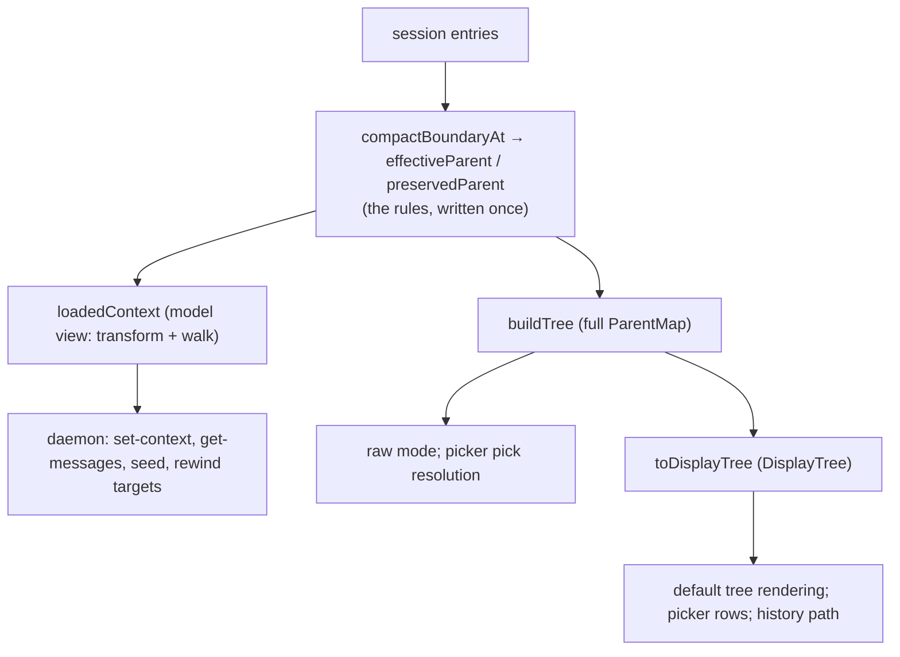

# Spec: session tree — loader model, full tree, display tree

> Status: **approved for implementation** (reviewer pass + owner
> decisions resolved, 2026-07-22; see WORK LOG). Supersedes
> `docs/specs/boundary-display-linearization.md` (whose user-facing goals
> carry over, but whose mechanism was built on a guessed loader model) and
> rewrites the relink machinery from `docs/specs/boundary-substructure.md`.
> Ground truth: the CLI loader's relink logic, read directly out of the
> bundled binary (see "Ground truth" below).

# SPEC

## Problem

Our model of the CLI loader (`effective-chain.ts`) was reverse-engineered
from probe behavior and guessed wrong in places: it special-cases the
summary entry via `isCompactSummary`, invents a relinked summary occurrence
(`S@B`), composes all boundaries through a running occurrence map, and has
no notion of the loader's cut. `buildTree` inherited that confusion
(summary lookahead, pending-relink deferral), and the display layer then
needed compensating machinery (block-tail exceptions, exhaustive
representative maps, path deduplication).

We have since decompiled the loader's actual relink transform. This spec
rebuilds the whole domain on it, as three layers in `src/core/tree/`:

- **`loadedContext`** — what the model sees: our best estimate of the
  transcript entries a resume would load, in exact order (a port of the
  loader transform, with named divergences — see Edge cases).
- **`buildTree`** — every occurrence: the full tree of all raw entries plus
  each valid boundary's relinked block. What `raw` filter mode shows; the
  superset every navigation target lives in.
- **`toDisplayTree`** — what the human sees: the full tree minus relinked
  duplicates and boundary forks, so a linear conversation with any number
  of compactions renders as one straight line.

## Ground truth: the loader's relink transform

Extracted from the Claude Code CLI binary v2.1.170 (Bun-compiled; the JS
bundle is embedded as plain text — `grep -a -o -b preservedMessages
<binary>` for offsets, then dump and read the surrounding minified source).
Re-extract the same way on CLI upgrades. The transform, applied to the
uuid→entry map (file order) at load time:

1. Let `K` = index of the **last** `compact_boundary` entry of any kind,
   and `meta` = the `compactMetadata` of the last boundary that has
   `preservedMessages` (or legacy `preservedSegment`). If no boundary has
   metadata, stop — no transform at all.
2. The relink rules run only when the metadata boundary IS the last
   boundary (last-wins is total). Resolve `preserved = {anchorUuid?,
   uuids}` (from the list, or a tail→head walk for `preservedSegment`).
3. If any preserved uuid names no transcript entry: telemetry, **abort the
   whole transform** (no rewrite, no cut).
4. If `uuids` is non-empty:
   - **Chain rewrite**: `uuids[0].parentUuid = anchorUuid`,
     `uuids[i].parentUuid = uuids[i-1]`.
   - **Anchor-child reparent**: EVERY entry with `parentUuid == anchorUuid`
     (except `uuids[0]`) gets `parentUuid = uuids.last()`. There is no
     summary concept: from-shape summary placement (anchor = boundary uuid,
     summary parented on the boundary) is just an instance of this rule.
     `isCompactSummary` appears nowhere in the transform.
   - Usage fields on preserved assistant entries are zeroed.
5. **The cut**: delete every entry with file index `< K` not in `uuids`
   (runs even when `uuids` is empty or the last boundary has no metadata —
   this is why an empty-`uuids` trailing boundary yields an empty context,
   P10). Then **orphan reparent**: surviving user/assistant entries whose
   parent was deleted get `parentUuid = uuids.last()` (only when `uuids`
   is non-empty).

6. **Leaf selection** (decoded from the transform's caller): collect
   entries that are nobody's parent in the TRANSFORMED relation; a single
   dangling tip is the leaf; with multiple tips — or when no relink ran —
   walk up from the last file entry (or an explicit leaf-marker entry) to
   the nearest user/assistant entry. No summary special-case: a file
   ending at an up_to summary has exactly one tip, the preserved tail,
   because the chain rewrite hangs `uuids[0]` under the summary.

The context a resume loads is then the ordinary `parentUuid` walk from
that leaf over the transformed map, boundaries acting as chain ends.

Caveats: binary v2.1.170 vs probes on v2.1.195/2.1.211 — every probe
observation in `docs/derisk/compact-boundary-injection/FINDINGS.md` is
consistent with this code except P3 m4's duplicate-uuid skip, which has no
visible check here (version drift, or downstream cycle detection). We keep
that validation, justified by the probe — it concerns duplicates WITHIN a
preserved list, distinct from duplicate file entries, which are legal
re-persisted copies (see Edge cases and
`docs/derisk/cli-history-repersistence/FINDINGS.md`).

Our implementation normalizes a metadata-less boundary to the equivalent
wipe `{anchorUuid: boundary, uuids: []}` at parse time (the SDK documents
absent `preservedMessages` as "unset when compaction summarizes
everything") instead of modeling step 1's metadata scan-back. Equivalent
everywhere except one named divergence — a file where NO boundary carries
metadata (see Edge cases). An INVALID preserved list (step 3) degrades to
the same wipe shape instead of aborting — a second named divergence (see
Edge cases). Step 6's tips analysis is implemented as a single climb from
the last surviving entry to the nearest user/assistant, treating the
boundary and its anchor as "the relinked chain's tail is the tip" —
equivalent for every native shape (the anchor case IS the
file-ends-at-up_to-summary case), and it excludes trailing system entries
from the context even when they are the sole dangling tip.

## Success criteria

1. `loadedContext` reproduces the transform's observable outcomes, each
   as a test case: metadata-less boundary (normalized to a wipe — one
   named divergence when NO boundary carries metadata; see Edge cases),
   valid empty list (pure wipe), invalid preserved list (degraded to a
   wipe — a named divergence; see Edge cases), anchor-child reparent,
   chain rewrite, orphan reparent, leaf climb (file ending at the
   boundary, at an up_to summary, and at trailing system entries). Scope:
   `preservedMessages` boundaries; deliberate divergences (preserved-list
   duplicate rejection, anchor-in-list rejection, legacy segments, usage
   zeroing) are named in Edge cases.
2. A native up_to compaction of a linear conversation renders linearly
   (default filter modes) — see the concrete example below. Several
   stacked compactions render as one straight line.
3. A boundary rewind (from-shape, no summary) with no new turn is
   invisible: the tree reads identically to a plain tail rewind, cursor on
   the rewind target.
4. `raw` filter mode renders `buildTree` verbatim, `~` marking every
   `@boundary` row. Default modes never render an `@boundary` row, so `~`
   appears only in `raw` mode.
5. `/tree` picker rows are display rows. User-row picks resolve their
   nearest assistant ancestor on the FULL tree (editing a post-compaction
   message stays inside the compacted context). Boundary-row picks "undo
   the boundary": rewind to the last assistant ref of
   `loadedContext(entries before the boundary)`, `newRoot` if none, no
   editor prefill. Summary-row picks keep the compaction in effect with
   the summary as-is (the summary reads as assistant-generated even
   though it is a user entry): a uuids-form set-context re-installing the
   fresh-compaction context — summary plus preserved chain, dropping
   post-compaction turns — no editor prefill.
6. TUI conversation history renders the display path: each message once,
   boundary banners and summaries in display order — no dedupe pass.
7. The `[cursor: …]` line keeps printing the true leaf uuid; the `*`
   marker sits on the leaf's visible display row (they legitimately differ
   after a fresh compaction: marker on the summary row, cursor on the
   preserved tip). A leaf on a rootless hidden chain
   (`nearestVisibleRow` → undefined) renders no marker.
8. Diagnostics: invalid relinks (missing preserved uuid, duplicates
   WITHIN a preserved list, an anchor among the preserved uuids), dangling
   anchors, and parent cycles report
   through `OnInvalid` and degrade per the Edge cases. Duplicate raw
   uuids in the file are tolerated silently — re-persisted entries, a
   legal CLI file shape (see Edge cases): first-wins for tree edges and
   displayed content; last-wins only inside `loadedContext`, matching the
   Claude loader. The display-payload amendment is specified in
   `docs/specs/canonical-session-entry-stream.md`.

## Concrete examples

Up_to compaction (raw `1→2→3→4`, boundary `B` preserving `[3,4]`, anchor =
summary `S`, next turn `5` with `parentUuid: 4`):

```
raw mode                          default modes
• 1 user: …                       • 1 user: …
• 2 assistant: …                  • 2 assistant: …
├─ 3 user: …                      • 3 user: …
│     4 assistant: …              • 4 assistant: …
└─ • B [compaction]               • B [compaction]
   • S compaction: …              • S compaction: …
   • ~3 user: …                   * 5 user: …
   • ~4 assistant: …
   * 5 user: …
```

Full tree: `S` under `B` (raw parent), `3@B` under `S` (chain rewrite),
`4@B` under `3@B`, `5` under `4@B` (parent decorated through the latest
boundary). Display: hide
`3@B`/`4@B`, reparent `B` onto raw `4`; `5`'s nearest visible ancestor is
`S`. Display order shows `S` after `3,4` although the loaded context is
`[S,3,4,5]` — accepted display fiction; `raw` mode shows the full
occurrence structure (neither the disk bytes nor the loaded context: the
diagnostic superset both derive from).

From-shape rewind to `2` (boundary `X` preserving `[1,2]`, anchor = `X`
itself, summary `T`, then one new turn `5` with `parentUuid: T`):

```
default modes
• 1 user: …
• 2 assistant: …
├─ • X [compaction]
│  • T compaction: …
│     * 5 user: …
└─ 3 user: …
      4 assistant: …
```

Full tree: `1@X` under `X`, `2@X` under `1@X`, `T` under `2@X`
(anchor-child rule — `T`'s single occurrence is raw), `5` under `T`.
Display: hide `1@X`/`2@X`; `X` reparents onto raw `2`; `T`'s nearest
visible ancestor is `X`.

Same rewind with NO summary and NO new turn: `X` has no visible
descendants and prunes away; the tree reads `1 → *2 → 3 → 4` —
indistinguishable from a plain tail rewind. The leaf ref `2@X` maps to
visible row `2` for the marker.

Stacked compactions (raw `1→2→3→4`, `B1` preserving `[3,4]` anchor `S1`;
turns `5,6`; `B2` preserving `[5,6]` anchor `S2`; turn `7`):

```
full tree:    1→2→3→4          display:   • 1 … • 2 … • 3 … • 4 …
              B1 under 2*, S1 under B1        • B1 [compaction]
              3@B1 under S1, 4@B1 under 3@B1  • S1 compaction: …
              5 under 4@B1, 6 under 5         • 5 … • 6 …
              B2 under 6*, S2 under B2        • B2 [compaction]
              5@B2 under S2, 6@B2 under 5@B2  • S2 compaction: …
              7 under 6@B2                    * 7 …
```

(`*` = logicalParentUuid anchor before display reparenting.) Display:
`B1` reparents onto raw `4`, `B2` onto raw `6`; hidden `4@B1` resolves
`5` to `S1`, hidden `6@B2` resolves `7` to `S2` — one straight line,
criterion 2's stacked case. `visibleRowOf` = `{3@B1→S1, 4@B1→S1,
5@B2→S2, 6@B2→S2}`; loaded context `[S2,5,6,7]`.

## Type design

New directory `src/core/tree/`. `src/core/tree.ts`, `build-tree.ts`,
`build-display-tree.ts`, and `effective-chain.ts` are deleted; their
survivors move as noted.

**`src/core/tree/nodes.ts`** — the node vocabulary, moved verbatim from
`src/core/tree.ts`: `TreeNodeRef`, `formatTreeNodeRef`, `parseTreeNodeRef`,
`treeNodeRefsEqual`, `ParentMap` re-export, `SessionSnapshot`, `PathNode`,
`pathToLeaf`, `treeChildren`, `isFinalAssistantEntry` (doc comments updated
to the new names).

**`src/core/tree/loader.ts`** — the loader model. Owns every relink rule.

```ts
/** Sink for corrupt-session-file diagnostics. */                 // moved from effective-chain.ts
export type OnInvalid = (message: string) => void;

/** A compact_boundary entry's relink instruction, mirroring the jsonl
 *  field names. Validity is a separate question (invalidRelinkReason) —
 *  parsing and validation are distinct in the binary too. */
export interface CompactBoundary {
  uuid: UUID;
  preservedMessages: { anchorUuid: UUID; uuids: UUID[] };
}

/** Parse the boundary at entries[boundaryIndex]. Precondition: that entry
 *  is a compact_boundary — throws otherwise (caller bug, not file
 *  corruption). Absent preservedMessages ("unset when compaction
 *  summarizes everything" per the SDK; also legacy segment-only
 *  boundaries) normalizes to the equivalent wipe
 *  `{anchorUuid: boundary, uuids: []}` — nothing pre-boundary survives
 *  either way (one named divergence; see Edge cases).
 *  Present-but-malformed metadata throws: file corruption, not a shape
 *  any producer writes. */
export function compactBoundaryAt(
  entries: SessionEntry[],
  boundaryIndex: number,
): CompactBoundary;

/** The reason this boundary's relink must not apply — a preserved uuid
 *  naming no file entry (loader-observed; anywhere in the file, NOT just
 *  earlier — the loader validates against the complete map), a
 *  duplicated uuid (probe-observed, P3 m4), or the anchor appearing
 *  among the preserved uuids (deliberate divergence; see Edge cases) —
 *  or undefined when the relink applies. loadedContext degrades the
 *  boundary to a full wipe (named divergence; see Edge cases); buildTree
 *  emits no block; both report it through their onInvalid. */
export function invalidRelinkReason(
  fileUuids: ReadonlySet<UUID>,
  boundary: CompactBoundary,
): string | undefined;

/** Loader parent of `entry` under `boundary`'s relink (undefined = no
 *  relink in effect): parentUuid == anchorUuid (uuids non-empty) →
 *  uuids.last(); otherwise the raw parent, which for a compact_boundary
 *  entry with no parentUuid is its logicalParentUuid (where the boundary
 *  event happened). A parent among the preserved uuids is returned as
 *  its relinked occurrence (viaBoundary set). THE anchor-child rule —
 *  the only place it is written; uuids[0] is exempt (its parent is
 *  parentOfPreserved's business). */
export function effectiveParent(
  boundary: CompactBoundary | undefined,
  entry: SessionEntry,
): TreeNodeRef | undefined;

/** Parent ref of uuids[index] inside the relinked chain: {anchorUuid}
 *  (bare — the anchor is not itself preserved) for index 0,
 *  {uuids[index-1], viaBoundary} after. THE chain-rewrite rule. */
export function parentOfPreserved(
  boundary: CompactBoundary,
  index: number,
): TreeNodeRef;

/** Our best estimate of the context the NEXT appended message will see:
 *  the loader transform of the current file — the last boundary's relink
 *  and cut, then ONE walk from the last surviving entry: climb silently
 *  to the nearest user/assistant, then append until a boundary ends the
 *  chain; reaching the boundary or its anchor before appending starts
 *  redirects to the relinked chain's tail. A trailing boundary is
 *  honored even though the binary applies it only on the next load,
 *  because that next load is exactly what the next appended message
 *  gets. Estimate: downstream request normalization (tool-pair
 *  sanitization, attachment dropping, API-message grouping — FINDINGS
 *  "failure modes") is out of scope. Replaces effectiveTreeNodeChain. An
 *  element carries viaBoundary iff its uuid is among the last boundary's
 *  preserved uuids. */
export function loadedContext(
  entries: SessionEntry[],
  onInvalid: OnInvalid,
): TreeNodeRef[];

/** Uuid projection of loadedContext. Replaces effectiveChain. */
export function loadedContextUuids(
  entries: SessionEntry[],
  onInvalid: OnInvalid,
): UUID[];
```

Deleted with no replacement: `BoundaryRelink`, `validRelink`, and
`summaryOf` — its two call sites were block-extent proxies that
reformulate onto `loadedContextUuids`:

- `set-context.ts` (viaBoundary rewind): "the chain the boundary
  installed" becomes `loadedContextUuids` of the file truncated at the
  NEXT `compact_boundary` (or EOF) instead of at the boundary's block
  end; the existing cut-at-target slice discards any post-block turns
  (the target is an assistant entry, never the summary).
- `get-messages.ts` (synthesis window): closed iff a POST-boundary
  user/assistant entry exists that is not the boundary's summary, where
  the summary is identified as `isCompactSummary === true &&
  parentUuid === lastBoundary.uuid`. Parentage alone cannot identify the
  summary: after an empty-uuids wipe the first REAL prompt also parents
  onto the boundary (P10). (Two drafts corrected during implementation —
  "last user/assistant in file order" misread a no-summary boundary with
  no post entries as closed; "parentUuid !== boundary closes" misread the
  post-wipe prompt as a summary — both caught by verifying against
  fixtures per this bullet's original instruction; see WORK LOG.)

`seedFromEntries` moves to `src/core/session-seed.ts` unchanged except for
calling `loadedContext`.

**`src/core/tree/build-tree.ts`**

```ts
/** Every occurrence: raw entries under their parents as interpreted
 *  through the latest boundary encountered so far (effectiveParent,
 *  decorated to `uuid@B` keys when the parent uuid is among that
 *  boundary's preserved uuids), plus each valid boundary's relinked block
 *  `uuids[i]@B → parentOfPreserved(i)` at the boundary's file position
 *  (block parent keys may be forward references: the up_to anchor, or a
 *  preserved uuid naming a later entry; a final pass nulls parents that
 *  never materialized). EVERY encountered boundary becomes the latest —
 *  an invalid or empty boundary contributes no rules but still ends the
 *  previous boundary's effect (last-wins).
 *  Exactly one raw occurrence per uuid-bearing entry — no occurrence map,
 *  no pending state, no summary special case. A duplicate occurrence key
 *  is first-wins: the repeat entry is skipped entirely — no edge
 *  overwrite, no re-emitted block, and a re-appended boundary entry does
 *  not become the latest boundary. Silent — a legal CLI file shape (see
 *  Edge cases). */
export function buildTree(
  entries: SessionEntry[],
  onInvalid: OnInvalid,
): ParentMap;
```

`buildTree` calls `compactBoundaryAt`, `invalidRelinkReason`,
`effectiveParent`, and `parentOfPreserved`; it restates no rule.

**`src/core/tree/display-tree.ts`**

```ts
export class DisplayTree {
  /** Visible rows only. */
  readonly parentMap: ParentMap;
  /** Hidden occurrence id → its nearest visible ancestor row, or null
   *  when the hidden chain is rootless (anchor-less or dangling-anchor
   *  blocks — hand-crafted/corrupt shapes). Defined for every hidden id
   *  (relinked rows, pruned boundary rows). */
  private readonly visibleRowOf: Map<string, string | null>;

  /** The row that displays `ref`: `ref` itself when visible — or unknown
   *  to the tree, so the caller's stale-ref handling still sees it — its
   *  nearest visible ancestor when hidden, undefined when the hidden
   *  chain is rootless (a leaf mapped here renders no marker, matching
   *  filtered-leaf behavior). */
  nearestVisibleRow(ref: TreeNodeRef): TreeNodeRef | undefined;
}

/** The human view, derived from the full tree by three rules:
 *  1. each boundary row with a valid non-empty preserved list reparents
 *     onto the raw row of its last preserved uuid;
 *  2. every `@boundary` row is hidden; anything whose parent is hidden
 *     displays under its nearest visible ancestor;
 *  3. a boundary row with a valid NON-EMPTY preserved list and no
 *     visible descendants is hidden too (fixpoint, so stacked navigation
 *     boundaries cascade away).
 *  Boundaries with no applicable relink — invalid or empty-list — keep
 *  their placement and stay visible: a context wipe is a real event the
 *  user performed, and hiding it would hide history. Display-only:
 *  loadedContext and the wire protocol are untouched. */
export function toDisplayTree(
  fullTree: ParentMap,
  entries: SessionEntry[],
): DisplayTree;
```

Taking `fullTree` as input keeps the derivation explicit at call sites and
makes the transform testable against hand-built maps. Precondition:
`fullTree` came from `buildTree` over the same `entries` — mismatched
inputs are unchecked. No `OnInvalid`: it re-derives boundary validity via
`compactBoundaryAt`/`invalidRelinkReason` without reporting (diagnostics
belong to the `buildTree` call).

**Consumers** (signatures, not implementations):

- `src/format/tree.ts`: `raw` stays in `FILTER_MODES`; `raw` renders
  `buildTree` output with `~` before the uuid column on `@boundary` rows;
  all other modes render `toDisplayTree(buildTree(...), ...)` with the
  leaf marker mapped through `nearestVisibleRow` when the leaf row is
  hidden.
- `src/tui/components/tree-selector.ts`: `TreeSelectorComponent` takes the
  `DisplayTree`; `resolveTreePick(fullTree, entries, entryOf, pick,
  onInvalid)` implements criterion 5 (boundary undo via
  `loadedContext(entries.slice(0, boundaryIndex))`; summary picks — rows
  identified by `isCompactSummary` + boundary parent — return
  `{kind: "setChain", uuids}` with the fresh-compaction context:
  `loadedContextUuids` of the file truncated just after the summary,
  filtered to user/assistant).
- `src/tui/interactive-mode.ts` / `sdk-render.ts`: `reloadHistory` renders
  `pathToLeaf(displayTree.parentMap, entryOf, visibleLeafRow)`;
  `dedupedPathNodes` is deleted (a display path has no duplicates by
  construction); `pathUpToBoundary` adapts to display rows (replay cut at
  the live leaf's visible row; keep post-leaf boundary/summary rows, whose
  live events render no text).
- Full migration surface (mechanical renames/imports beyond the above):
  `src/core/daemon/request-handlers.ts`, `daemon.ts`, `set-context.ts`,
  `get-messages.ts` (`effectiveChain`/`effectiveTreeNodeChain` →
  `loadedContext*`, `summaryOf` call-site reformulations per Type
  design), `src/format/input.ts` and
  daemon startup (`seedFromEntries` relocation), plus tests and doc
  comments referencing the old occurrence semantics.

## Data flow



## Cost

- Compute/memory: each layer parses boundaries once per invocation and
  runs in O(n) with small maps (display pruning marks every strict
  ancestor of every plain row, each walk stopping at the first
  already-marked node — forward block references mean rows are NOT
  strictly children-after-parents in materialization order, so no single
  ordered sweep works). Negligible at session-file scale.
- The real cost is **regression surface**: this rewrites the shipped
  `effective-chain.ts`/`build-tree.ts` semantics and discards most of the
  uncommitted boundary-display-linearization implementation. Mitigations:
  test fixtures re-derived from the ground-truth transform; the derisk
  harness + `check-reports.mjs` remain the CLI-upgrade gate. Review effort
  should concentrate on `loader.ts`'s fidelity to the dump.

## Edge cases

- **Empty `uuids`**: valid; rules no-op (children of the anchor stay put),
  the cut still deletes everything before the boundary (P10).
- **Invalid relink** (`invalidRelinkReason` set — a preserved uuid naming
  no file entry, a duplicated uuid, or the anchor appearing among the
  preserved uuids): in the tree domain the boundary emits no block, stays
  at its logicalParentUuid anchor, and remains visible. In
  `loadedContext` it DEGRADES TO A FULL WIPE (`onInvalid` reports it,
  surfaced as a banner) — a named divergence: the binary aborts the whole
  transform and loads raw parents, which resurrects pre-boundary context
  wherever a surviving entry raw-parents into it; cutting instead errs in
  the safe direction on a corrupt file. Validation is against uuids
  anywhere in the file (loader-faithful), not "earlier entries" as the
  old code required.
- **Metadata-less boundaries normalize to a wipe** at parse time, so no
  code path handles "no relink instruction". Equivalent to the binary
  except when NO boundary in the file carries `preservedMessages`: the
  binary then loads the file untransformed (no cut); we cut at the last
  boundary. Hand-crafted/legacy files only — every native compaction
  writes metadata on its boundary. Present-but-malformed metadata (uuids
  not an array, anchorUuid missing) throws instead: real corruption,
  surfaced as a banner rather than silently reinterpreted.
- **Preserved uuid naming a LATER entry** (hand-crafted): valid per the
  loader. `buildTree`'s block emits with forward parent keys that resolve
  when the raw rows arrive; the final pass nulls any that never do.
- **Duplicate raw uuids in the file**: not corruption — the CLI
  re-persists dropped-from-context history immediately before a later
  /compact, with relinks materialized into raw `parentUuid` pointers
  (`docs/derisk/cli-history-repersistence/FINDINGS.md`). Tree edges
  (`buildTree`) and displayed payload lookups (`entriesByUuid`) are
  first-wins: a copy can carry degraded sidecar data and is re-persisted
  under a different latest boundary, so replaying either its payload or
  edge would reinterpret the original entry. The `loadedContext`
  transform remains last-wins to match the loader's uuid-keyed map; it is
  a model of Claude loading, not display canonicalization. Last-wins
  edges would also make display rule 1 (boundary → raw `uuids.last()`)
  cyclic on the observed file shape. Skipped silently, no `onInvalid`: a
  report would fire on every fetch of a legal file. See
  `docs/specs/canonical-session-entry-stream.md` for the amendment.
- **Up_to anchor entry never arrives** (corrupt): the block's forward
  anchor reference dangles; the final `buildTree` pass nulls it (block
  becomes a root fork), `onInvalid` reports it.
- **Entry parenting into an earlier boundary's preserved region** after a
  later boundary exists: raw parent (only the latest boundary decorates) —
  matches the loader's last-wins, diverges from the old
  occurrence-composition behavior. Not observed in native files (post-
  boundary writes parent onto the active playlist only).
- **Boundary whose logicalParentUuid is absent/unknown**: root, as today.
- **Parent cycles** (corrupt files; possible through raw parentUuid
  pointers): the `loadedContext` walk reports via `OnInvalid` and stops,
  as today; `pathToLeaf` keeps its throw.
- **From-shape rewind history**: the abandoned pre-rewind tail no longer
  replays in TUI history (the old full-tree path reached it through the
  boundary's logicalParent anchor; the display path does not). The
  abandoned branch stays visible in the tree views. Deliberate — history
  shows the human view of the active conversation.
- **From-shape summary refs lose `viaBoundary`**: the summary is no
  longer in the relinked list, so a fresh from-shape context tip is the
  bare summary ref (previously `S@B`). Wire-visible leaf-shape change;
  consumers only compare refs structurally, but this must be verified at
  the fold/seed boundary during implementation.
- **Non-goals / named divergences**: the loader's usage-zeroing (step 4)
  is not modeled — `loadedContext` returns refs, not rewritten payloads;
  legacy segment-only (`preservedSegment`) boundaries normalize to a wipe
  (the loader resolves them via a tail→head walk and they relink fine per
  P1e-4 — a divergence with zero observed exposure: every local session
  file with `preservedSegment` also carries `preservedMessages`; should
  it ever bite, the fix is confined to `compactBoundaryAt` — walk
  tail→head over raw parentUuid and yield ordinary `preservedMessages`); preserved lists containing duplicate
  uuids are rejected where the 2.1.170 binary shows no check (P3 m4
  observed the skip on 2.1.195); an anchor appearing among the preserved
  uuids is rejected where the binary proceeds — its sequential
  rewrite-then-reparent passes self-parent the chain there (a parent
  cycle), and the rejection is also what makes our
  apply-on-raw-parents-then-override order equivalent to the binary's
  sequential order everywhere the relink applies (real files never take
  the shape: the anchor is the summary or the boundary's own uuid, never
  preserved history); any wire-protocol or set-context change.

# IMPLEMENTATION IDEAS

- Port `loader.ts` first, with tests transliterated from the decompiled
  steps (each step = a describe block citing the dump). Then `tree/build-tree.ts`
  against the same fixtures, then the display transform, then consumers.
- `loadedContext` can implement the transform without mutating entry
  copies: compute the last boundary's `CompactBoundary`, then walk from
  the tip using `effectiveParent`/`preservedParent` as overrides, tracking
  the cut set for orphan reparenting. Whichever formulation stays closest
  to auditable-against-the-dump wins; a literal map-rewrite port is
  acceptable if clearer.
- Tip selection is ground-truthed (step 6) but implemented as the single
  leaf climb (see Ground truth's divergence paragraph), which replaced
  both the `summaryOf`-based special-casing and an interim dangling-tip
  analysis. Verify against the loader test fixtures that outcomes match
  on native shapes.
- `reloadHistory`'s raced-leaf fallback (leaf ref in neither `parentMap`
  nor `visibleRowOf`): keep today's semantics — warn and replay the full
  path — expressed in display rows.
- Nearest-visible-ancestor + pruning cannot be a single ordered sweep —
  forward block references mean materialization order is NOT
  children-after-parents. Implemented as ancestor marking (pruning) and
  memoized path compression (ancestor resolution), both O(n).
- Leaf selection (step 6) has imprecise corners in our transcription:
  which entry kinds act as explicit leaf markers, uuid-less entries,
  a boundary as the sole dangling tip, cycles. Re-dump the transform's
  caller (byte ~242272200 in the 2.1.170 binary) while implementing and
  pin each predicate; until then, match the existing effective-chain
  fixtures on native shapes.
- Duplicate-tolerance verification: run `buildTree` and `loadedContext`
  over a COPY of the real affected session named in
  `docs/specs/repersisted-duplicates-handoff.md` (237 duplicated uuids) —
  no throw, one raw occurrence per uuid; do not commit session files or
  their contents. Collateral from that handoff: flip the tests asserting
  the duplicate throw (`build-tree.test.ts`, `format/tree.test.ts`), add
  a re-persist-block fixture test, and fix the now-false comments
  (`entriesByUuid` in `session-file.ts`, `format/input.ts` ~line 111,
  P2 d scope note in the compact-boundary-injection FINDINGS).

# WORK LOG

**Instructions**: Update this section during each work session. Add new
tasks, mark completed ones with [x], document decisions and problems
encountered.

## 2026-07-23 — Anton's review round (4a4d321), IMPLEMENTED

- [x] Producer-drift alarm: a boundary carrying a raw `parentUuid`
      banners through `onInvalid` (the walk treats boundaries as chain ends
      BECAUSE the CLI writes them parentless; a raw parent means the relink
      model needs re-deriving). Placed at the boundary parse site, not in
      `parentOf`'s boundary branch as the TDC suggested — that branch is
      unreachable from the walk (it breaks at boundaries before calling
      `parentOf`), so a banner there would be dead code.
- [x] The leaf climb and the chain walk merged into one walk (climb
      silently to the nearest user/assistant, then append until a boundary
      ends the chain). Two subtleties beyond the TDC's sketch: the
      boundary/anchor redirect applies mid-climb, checked BEFORE the
      user/assistant test (the up_to summary is a user entry); and the
      redirect makes the walk legitimately revisit the anchor (climb passes
      through the summary, append returns to push it), so the cycle guard
      resets at the redirect and the redirect is once-only (a hand-crafted
      all-system preserved chain would otherwise loop tail → anchor →
      redirect forever).

## 2026-07-23 — Anton's review round (61c8fe6), IMPLEMENTED

TDC comments in 61c8fe6, all on `loader.ts` (his direct edits kept: the
`summaryChainUuids` NOTE, the inline orphan-reparent comment, the
`parentOfPreserved` wording). Decisions, agreed in conversation:

- [x] Spec citations must name the file: "see the spec's Edge cases" →
      "see Edge cases in docs/specs/session-tree.md" everywhere (a source
      file cannot be assumed to belong to a single spec).
- [x] Invalid preserved list: DEGRADE the boundary to a full wipe
      `{anchorUuid: boundary, uuids: []}` instead of the binary-faithful
      abort-to-raw-walk. Discussed at length: the abort is genuinely what the
      binary does (no cut — a surviving entry raw-parenting into pre-boundary
      history resurrects it), and no wipe placement reproduces it; Anton
      chose the divergence — the safe direction for a corrupt file, kills
      `cutApplies`, and `onInvalid` still banners it. Second named
      divergence recorded in Ground truth + Edge cases; the two abort tests
      now assert `[u2]` instead of walk-through `[u1, a1, u2]`.
- [x] `preservedTail` is the anchor when uuids is empty (as a
      `TreeNodeRef`; for a wipe that is the boundary itself, so orphan
      reparent lands there and the chain stays empty).
- [x] Tips analysis replaced by Anton's single leaf climb: from the last
      surviving entry to the nearest user/assistant; reaching the boundary
      (file ends at it — fixes the fallback hole he flagged) or its anchor
      (file ends at an up_to summary) yields the relinked chain's tail.
      Supplemented with the nearest-user/assistant climb his sketch omitted
      (native files end with `turn_duration` system entries). Verified
      case-by-case against all loader fixtures. `relinked` died with the
      tips pass.
- [x] `effectiveParent` returns `TreeNodeRef | undefined` (decorating a
      preserved parent with viaBoundary itself) and `loadedContext`'s
      `parentOf` is ref→ref; the chain walk pushes refs directly and
      `buildTree` dropped its `preservedSet` re-decoration.

## 2026-07-23 — Anton's review round (c76f468), IMPLEMENTED

TDC comments + direct changes in c76f468 (his renames kept:
`parentOfPreserved`, `parentOfBoundary`, `nearestVisibleAncestorCache`,
header now v2.1.195). Answers given in conversation; decisions and the
fix plan, all items now implemented (TDC comments removed as each
landed):

1. `CompactBoundary`: `preservedMessages` AND `anchorUuid` both REQUIRED
   (Anton's call, pre-compaction exchange). `compactBoundaryAt`
   NORMALIZES absent preservedMessages (SDK: "unset when compaction
   summarizes everything"; also legacy segment-only) to the wipe shape
   `{anchorUuid: boundary.uuid, uuids: []}` — semantically equivalent
   ("everything summarized" ⇒ nothing pre-boundary in context). NAMED
   DIVERGENCE to add to Edge cases: a file where NO boundary carries
   preservedMessages — the binary loads it untransformed (no cut); we
   cut at the last boundary. Hand-crafted/legacy only. This kills the
   look-beyond-the-latest-boundary metadata scan, the anyMetadata flag,
   the `Required<CompactBoundary>` dance, and invalidRelinkReason's
   metadata-less case. PRESENT but malformed metadata (uuids not an
   array, anchorUuid missing) THROWS — keeps Anton's restored `.catch`
   comment in interactive-mode accurate.
2. `parentOfPreserved` returns `TreeNodeRef` (index 0 → `{uuid: anchor}`,
   else `{uuid: uuids[i-1], viaBoundary}`), never undefined now;
   buildTree's block loop becomes
   `formatTreeNodeRef(parentOfPreserved(...))`.
3. `effectiveParent(boundary | undefined, entry)`: absorbs boundary
   logicalParentUuid anchoring (raw parent = parentUuid ??
   logicalParentUuid for boundary entries) so buildTree drops its
   `anchored` spread and always calls effectiveParent. CAVEAT (verified
   by analysis, holds under Anton's next-append semantics too):
   loadedContext must NOT let boundaries contribute edges — its parentOf
   returns undefined for boundary entries (chain ends) and the tips pass
   skips boundaries as edge sources. Otherwise the boundary's logical
   anchor points at the preserved tail, every survivor becomes someone's
   parent, single-tip detection dies, and a file ending at an up_to
   summary collapses to [summary], losing the preserved chain. The
   logical anchor is tree-domain placement, not a loaded-relation edge.
4. `loadedContext` REWRITE (walk-back, no map mutation, no
   build-then-delete). Doc states Anton's semantics: the context the
   NEXT appended message will see (= loader transform of the current
   file; a trailing valid boundary shows its relinked chain). One loop
   builds byUuid (last-wins) + lastIndexOf; cutIndex = last boundary
   (none → plain walk); boundary = compactBoundaryAt(cutIndex), always
   metadata-bearing post-normalization; invalid list → onInvalid + plain
   walk (abort: no relink, no cut); relink = boundary when uuids
   non-empty; cutApplies = !aborted;
   deleted(u) = cutApplies && lastIndexOf(u) < cutIndex && !preserved;
   parentOf(uuid, entry) = boundary → undefined; preserved →
   parentOfPreserved(...).uuid; else effectiveParent with orphan redirect
   (parent deleted && entry user/assistant && tail exists →
   preservedTail); leaf = single dangling tip over SURVIVORS (preserved ∪
   uuids at/after cutIndex; boundaries skipped as edge sources) when
   relink ran, else nearest user/assistant walk from last surviving
   entry (deleted → stop); chain walk from leaf, boundaries/deleted end
   it, viaBoundary iff preserved. Tips analysis is REQUIRED (file ending
   at up_to summary: leaf = preserved tail, not derivable from last
   entry) but only over survivors, not the file.
5. buildTree parentKey: always `formatTreeNodeRef(...)`, viaBoundary set
   conditionally (never assume format({uuid}) === uuid).
6. display-tree: delete `walked`, iterate `onWalk` (same membership).
   DisplayTree becomes a CLASS: public parentMap, PRIVATE visibleRowOf,
   method taking TreeNodeRef → TreeNodeRef | undefined (visible → itself;
   hidden → nearest visible ancestor's ref; explicit null → undefined;
   absent from tree → itself so stale-leaf handling still warns). Callers
   migrate: interactive-mode visibleRow closure deleted, format/tree.ts
   leaf-marker mapping, tree-selector cursor; tests use the method.
7. sdk-render `pathUpToBoundary(path, leaf: TreeNodeRef | undefined)`
   (match via treeNodeRefsEqual) — revert my string-ification.
8. tree-selector: DELETE `boundaryToUndo`; only actual boundary rows
   undo. Summary picks (Anton's semantics: compaction stays in effect,
   summary as-is, no editorText) emit `{kind: "setChain", uuids}` — the
   uuids-form set-context; the old summary entry is itself a preserved
   uuid, so the appended boundary reproduces the compacted context
   exactly (P9 a; approach B, chosen over teaching the daemon
   non-assistant rewind targets, whose no-write resumeSessionAt path is
   unprobed for user-type leaves). interactive-mode routes the new kind
   to set-context. REFINEMENT during implementation (flagged to Anton):
   the chain is the FRESH-COMPACTION context — `loadedContextUuids` of
   the file truncated just after the summary entry = summary +
   preserved chain — not "installed chain truncated at the summary" as
   first planned: for an up_to boundary the installed chain is
   [summary, ...preserved], so truncating at the summary would drop the
   preserved tail (rows displayed ABOVE the picked row), which is not
   "compaction still in effect". Identical for the from shape. Spec
   criterion 5 updated + tests.
9. set-context final-entry validation: dedupe first — build
   firstIndexOf(uuid→first index); a later entry only invalidates if it
   IS a first occurrence (kills both re-persisted target copies and
   re-persisted earlier-sibling copies). Add earlier-sibling test.
10. COMMENT AUDIT (all files from this implementation): no step-number
    jargon ("Step 3/4/5/6"), no implementation narration, no restating
    effectiveParent's rule in comments; explain what + non-obvious why.
    Keep probe ids (P10, P3 m4) with "see file comment" pattern. Keep
    Anton's trimmed docstrings.
11. Kept-as-is pending Anton: anchor-in-list rejection stays (no probe
    observed the binary allowing it; inferred cycle from decompiled pass
    order); invalid/empty-list boundaries stay visible (spec Edge cases:
    wipe is a real event). Remove each TDC comment as its item lands.
12. Test fallout from the normalization: "no metadata anywhere → no
    transform" loader test flips to the named-divergence behavior (only
    metadata-less boundaries → cut at the last one); metadata-less
    parsing test now expects the wipe shape; ground-truth section and
    success criterion 1 get the divergence note.

Order: loader.ts rewrite + tests → build-tree → display-tree + consumers
(format/tree, tree-selector, interactive-mode) → sdk-render →
set-context → comment audit → spec criterion 5 + this entry → treefmt ×2
→ presubmit. Executed in that order; spec sections updated alongside:
Ground truth (normalization caveat), criteria 1/5/7, Type design
(CompactBoundary required fields, effectiveParent signature,
parentOfPreserved → TreeNodeRef, loadedContext next-append semantics,
DisplayTree class with nearestVisibleRow, consumer bullets), Edge cases
(metadata-less-normalizes-to-wipe divergence, legacy-segment bullet).
Open item still pending Anton: leaf-marker predicate re-dump.

- [x] `src/core/tree/` scaffolding: move `nodes.ts`, port `loader.ts` with
      dump-cited tests
- [x] `tree/build-tree.ts` + tests (native shapes, stacked boundaries, corrupt
      shapes)
- [x] `display-tree.ts` + tests (success criteria 2, 3, and the examples)
- [x] Consumers: `format/tree.ts`, tree-selector, reloadHistory; delete
      `dedupedPathNodes`, `validRelink`, `summaryOf`, old modules;
      reformulate the two `summaryOf` call sites per Type design
- [x] Presubmit + the post-implementation critical review

## 2026-07-22 — post-implementation review round

`npm run presubmit` green. Reviewer 8a0b9e57 (revived from the spec
review) reviewed the implementation; accepted findings, all fixed:

1. **anchor ∈ uuids breaks the rule-ordering equivalence** — the binary's
   sequential anchor-child pass sees post-rewrite parents, so an anchor
   among the preserved uuids self-parents the chain (a cycle) where our
   raw-parents-then-override order does not. Resolved by REJECTING the
   shape: a third `invalidRelinkReason` (named divergence like the P3 m4
   duplicate rejection — real files never take the shape; the rejection
   is also what makes the ordering equivalence hold everywhere the relink
   applies). Edge cases updated; regression tests.
2. **`toDisplayTree` duplicate guard** now first-wins over ALL
   uuid-bearing entries, matching `buildTree` exactly (previously only
   valid-non-empty first occurrences were guarded, so a divergent later
   boundary copy could be processed). Regression test.
3. **Display pruning rewritten to ancestor-marking**: mark every strict
   ancestor of every plain row, each walk stopping at the first
   already-marked node — O(n) as the Cost section claims (the
   per-candidate DFS was O(candidates × n)); the marks double as the
   cycle guard and the children map is gone.
4. **Synthesis window vs P10**: after an empty-uuids wipe the first REAL
   prompt also parents onto the boundary, so parentage alone
   misclassified it as a summary. Corrected formula: the window stays
   open only for the boundary's `isCompactSummary` child; any other
   post-boundary user/assistant closes it. Type design bullet updated
   (second correction); test.
5. **TUI `visibleRow`**: an explicit null mapping (rootless hidden leaf)
   now renders no path, per the documented `visibleRowOf` contract —
   previously `?? id` swallowed the null and triggered the raced-leaf
   warning.
6. **set-context final-entry validation** exempts re-persisted copies of
   the target itself (same uuid shares message.id — legal file shape).
   Test.
7. Restored direct `session-seed.test.ts` (five tests from the deleted
   effective-chain suite); added the viaBoundary-rewind post-block-turns
   fixture; fixed the `buildTree` forward-reference doc wording (only
   the up_to anchor's raw occurrence is a genuine forward reference).

Round 2: reviewer confirmed all six resolved and flagged one more —
`nearestVisibleAncestor` walked the hidden chain per row (O(m²) over an
m-row hidden block). Fixed with memoized path compression (each node
walked at most once; the whole transform is O(n)). Spec brought in line:
criteria 1 and 8 and the Type design `invalidRelinkReason` comment now
name the anchor-in-list rejection; the Implementation Ideas
child-count note replaced by the ancestor-marking/path-compression
description.

Open item, needs Anton: the **leaf-marker predicate re-dump**
(IMPLEMENTATION IDEAS) was not done — leaf selection matches the old
effective-chain fixtures on native shapes, but the imprecise corners
(explicit leaf-marker entry kinds, uuid-less trailing entries, a boundary
as sole dangling tip) remain unpinned against the binary's caller at
byte ~242272200.

## 2026-07-22 — implementation (tasks 1–4 done)

All four build tasks landed: `src/core/tree/{nodes,loader,build-tree,
display-tree}.ts` (+tests), `src/core/session-seed.ts`; deleted
`effective-chain.ts`, old `build-tree.ts`, `build-display-tree.ts`,
`tree.ts` (+their tests); all consumers migrated. tsc, eslint, treefmt,
and the full suite (417 tests) are green. Duplicate-tolerance verified
against a copy of the real re-persisted session (237 dup uuids, no throw,
one raw occurrence per uuid, no diagnostics); copy deleted, nothing
committed. Collateral done: `entriesByUuid`/`format/input.ts` comments,
P2 d scope note, re-persist-block fixture test, duplicate-throw tests
flipped.

One spec deviation found during fixture verification (the spec's own
"verify both reformulations" instruction): the get-messages synthesis
window formula "open iff the LAST user/assistant entry parents onto the
boundary" is wrong for a no-summary boundary with no post entries (the
last user/assistant is then pre-boundary → would read closed; the
startup-inside-window fixture requires open). Implemented instead:
window CLOSED iff a POST-boundary user/assistant entry exists whose
parentUuid !== boundary.uuid — same spirit (no summaryOf; the summary is
whatever post-boundary entry parents onto the boundary), fixture-exact.

`npm run presubmit` green (417/417). Type design get-messages bullet
updated to the corrected formula (superseded again by the review round's
finding 4 above).

## 2026-07-22 — approved for implementation

All reviewer conditions and owner decisions resolved. Implementation
builds FORWARD from the tree as committed (no revert of the discarded
boundary-display-linearization files — they all get rewritten or moved
anyway). Anton verified the loader's relink logic is unchanged at the
latest CLI version, so the 2.1.170 dump stands as ground truth.

## 2026-07-22 — TDC round: terminology, summaryOf, duplicate uuids

Anton's review comments (e8ad242) plus the cli-history-repersistence
finding (separate thread). Decisions folded in: "lens" terminology
dropped (the concept is just the latest boundary encountered so far);
`summaryOf` deleted — both daemon call sites were block-extent proxies
and reformulate onto `loadedContextUuids` (set-context: truncate at the
NEXT boundary; get-messages window: last user/assistant entry parents
onto the last boundary); duplicate raw uuids are legal re-persisted
entries, not corruption — last-wins for content/`loadedContext`
(loader-faithful), first-wins for `buildTree` edges (copies are
re-persisted under a different latest boundary, so replaying their edges
would reinterpret them; the loader never recomputes that far back, and
last-wins edges would make display rule 1 cyclic on the observed file).

## 2026-07-22 — reviewer pass (pre-implementation)

Fresh-context reviewer (8a0b9e57; spawned unanchored deliberately — the
prior reviewer was steeped in the invalidated model). Major accepted
findings: validation was stricter than the loader (earlier-entry vs
anywhere-in-file); parse and step-3 validation split into
`compactBoundaryAt` + `invalidRelinkReason` (mirroring Iaf/GD9) so
invalid-at-last-boundary (abort, no cut) and metadata-less (cut) stay
distinct; `summaryOf` survives for daemon bookkeeping (synthesis window,
block end) and moves to `session-file.ts`; `visibleRowOf` values now
nullable for rootless hidden chains; empty-list (wipe) boundaries stay
visible; segment-only contradiction removed; "exact messages"/"O(n)
single-pass" overclaims softened; stacked worked example added;
latest-boundary lifecycle and logicalParent decoration made explicit.
Pushed back
(reviewer accepted): discriminated-union parse result, renames of
`visibleRowOf`/`loadedContext`. Verdict: approved, conditional on two
owner decisions — legacy `preservedSegment` modeling, and the from-shape
history-tail change.

## 2026-07-22 — spec created

Written after decompiling the loader's relink transform from the bundled
CLI binary (v2.1.170), which invalidated the previous model
(`isCompactSummary` special-casing, `S@B` occurrences, occurrence
composition across boundaries). Supersedes
`docs/specs/boundary-display-linearization.md`; the uncommitted
implementation of that spec is largely discarded by this one.
